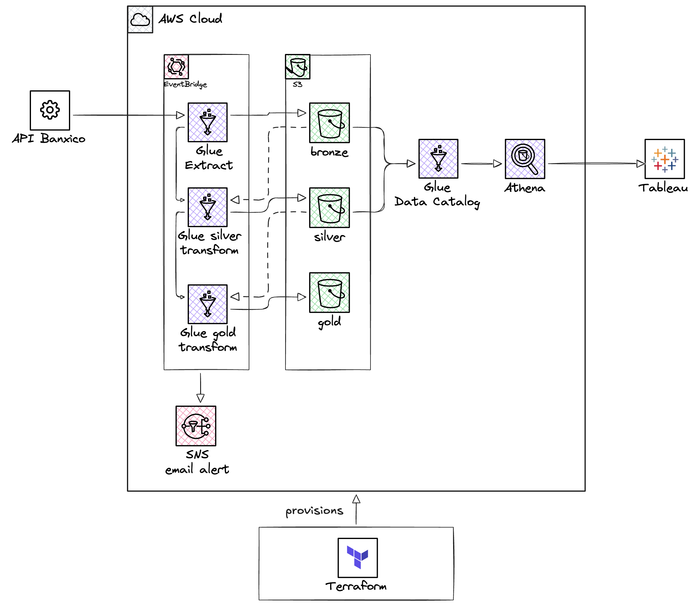

# banxico-pipeline

End-to-end financial data pipeline ingesting macroeconomic indicators from [Banxico's SIE API](https://www.banxico.org.mx/SieAPIRest/service/v1/) into a medallion architecture on AWS. Built as a portfolio project demonstrating production-grade data engineering for fintech use cases.

[](https://aws.amazon.com/glue/)
[](https://www.terraform.io/)
[](https://public.tableau.com/app/profile/andrea.ferro/viz/MacroConditionsDashboardforFintechLendinginMexico/Dashboard)

**[→ Live Dashboard: Mexico Macro Conditions for Fintech Lending](https://public.tableau.com/app/profile/andrea.ferro/viz/MacroConditionsDashboardforFintechLendinginMexico/Dashboard)**

---

## What this project does

Fintechs operating in Mexico need to monitor three macro indicators daily: the USD/MXN exchange rate, the TIIE 28-day interbank rate, and INPC inflation. This pipeline automates that ingestion — pulling from Banxico's public API, transforming raw JSON into analytics-ready Parquet, and exposing the data through Athena and Tableau Public.

The pipeline runs daily at 8am UTC via AWS Glue Workflow scheduled trigger, automatically extracting the latest data and regenerating the Gold aggregation layer.

---

## Architecture



The pipeline follows a Bronze → Silver → Gold medallion architecture:

- **Bronze** — raw Banxico API responses stored as immutable JSON partitions in S3. `execution_date` reflects when the pipeline ran, never the data date.
- **Silver** — cleaned and typed Parquet files partitioned by `year/month`. Date columns forced to `pa.date32()` for Athena compatibility.
- **Gold** — monthly aggregated macro indicators joining all three series. One file per pipeline execution for full auditability.

Glue Jobs orchestrated via Glue Workflow with conditional triggers. All infrastructure managed by Terraform.

---

## Stack

| Layer | Technology |
|---|---|
| Ingestion | Python 3.9, Requests, Tenacity |
| Storage | AWS S3 (Bronze/Silver/Gold) |
| Transformation | AWS Glue Python Shell, Pandas, PyArrow |
| Catalog | AWS Glue Data Catalog |
| Query | AWS Athena |
| Orchestration | AWS Glue Workflow |
| Alerting | AWS SNS |
| Secrets | AWS SSM Parameter Store |
| IaC | Terraform |
| Visualization | Tableau Public |

---

## Series ingested

| Series ID | Name | Frequency |
|---|---|---|
| SF43718 | USD/MXN FIX exchange rate | Daily |
| SF60648 | TIIE 28-day interbank rate | Daily |
| SP1 | INPC consumer price index | Monthly |

---

## Quickstart

### Prerequisites

- Python 3.12 (via pyenv)
- AWS CLI configured with a profile (`your-aws-profile`)
- Terraform >= 1.5.0
- Banxico API token ([request here](https://www.banxico.org.mx/SieAPIRest/service/v1/token))

### Setup

```bash
git clone https://github.com/andreaferrofdz/banxico-pipeline.git
cd banxico-pipeline

python -m venv .venv
source .venv/bin/activate
pip install -r requirements-dev.txt

cp .env.example .env
# Fill in BANXICO_TOKEN, BUCKET_NAME, AWS_REGION, AWS_PROFILE
```

### Deploy infrastructure

```bash
cd terraform
terraform init
terraform apply
```

### Run the pipeline

```bash
# Initial backfill (2023 to present)
python3 src/pipeline.py --mode backfill --start-date 2023-01-01

# Daily run
python3 src/pipeline.py
```

### Deploy to Glue

```bash
./scripts/deploy.sh
```

This script cleans the Python cache, packages the `checkpoints` module, and applies Terraform — uploading all scripts to S3 and updating the Glue Jobs in one command.

---

## Repository structure

```
banxico-pipeline/
├── docs/
│   └── architecture.png          # Architecture diagram
├── notebooks/
│   ├── 01_exploration_banxico_api.ipynb
│   ├── 02_bronze_to_silver_columnar.ipynb
│   └── 03_silver_to_gold_aggregation.ipynb
├── scripts/
│   └── deploy.sh                 # Build zip + terraform apply
├── src/
│   ├── pipeline.py               # Local orchestrator
│   ├── extract/
│   │   └── banxico_api.py        # Bronze layer extractor
│   ├── transform/
│   │   ├── silver.py             # Silver transformation
│   │   └── gold.py               # Gold aggregation
│   └── checkpoints/
│       └── checkpoints.py        # S3-backed checkpoint store
├── terraform/
│   ├── main.tf                   # All AWS resources
│   ├── variables.tf
│   └── outputs.tf
├── requirements.txt              # Production dependencies
├── requirements-dev.txt          # Development dependencies
└── .env.example
```

---

## Architecture decisions

**Bronze is immutable and auditable.** `execution_date` in S3 paths reflects when the pipeline ran, never the business date of the data. This makes every extraction reproducible — you can always tell when a file was written and what data it contains.

**Backfill uses `range_start/range_end` partitions.** During backfill, each monthly extraction gets its own S3 path segment (`range_start=YYYY-MM-DD/range_end=YYYY-MM-DD/`). Multiple backfill runs on the same `execution_date` coexist safely without overwriting each other.

**`pa.date32()` forced explicitly in Silver.** Pandas defaults to `TIMESTAMP(NANOS)` when writing Parquet, which Athena/Trino cannot read as `DATE`. Explicitly casting via PyArrow schema eliminates this incompatibility.

**Partition registration via `glue_client.create_partition()`.** Instead of running `MSCK REPAIR TABLE` manually or using a Glue Crawler, partitions are registered programmatically after each write. The call is idempotent — `AlreadyExistsException` is silently ignored.

**Gold partitioned by `execution_date`, not business date.** The Gold dataset is ~40 rows — partitioning by `year/month` would create 40 files of ~1KB each. One file per pipeline execution gives full auditability without over-partitioning.

**AES256 encryption over KMS.** Data ingested from Banxico is already public. KMS adds cost and operational complexity without meaningful security benefit for publicly available data.

**SSM Parameter Store for Banxico token.** The API token is retrieved at runtime from SSM (`/banxico-pipeline/dev/banxico-token`) in production. It never appears in Terraform state, job logs, or environment variables in Glue.

**Python Shell Glue jobs, not Spark.** The dataset is small (~800 rows/series). Spark would be significant over-engineering. Python Shell jobs at 0.0625 DPU cost ~$0.002 per execution.

---

## Production considerations

**INPC publication lag.** Banxico publishes INPC 10–15 days after month-end. Daily mode always targets the previous closed month for SP1. March and April 2026 data appearing as `null` in Gold is expected behavior, not a bug.

**TIIE includes weekends.** Unlike USD/MXN which only has values on business days, TIIE 28 carries the Friday rate through Saturday and Sunday. No weekend filtering is applied in Silver — this is correct per Banxico's methodology.

**Retry policy is conservative.** `fetch_serie` retries only on 5xx errors, timeouts, and connection errors (not 4xx). A 400 from Banxico means bad request parameters — retrying would not help and would delay failure detection.

**Reproducibility.** The entire infrastructure is managed by Terraform. A fresh deployment requires only `terraform apply` followed by an initial backfill run. No manual steps, no `MSCK REPAIR TABLE`.

---

## Author

**Andrea Ferro** — Data Engineering Consultant, Mexico City

[LinkedIn](https://www.linkedin.com/in/andrea-ferro-fdz) · [GitHub](https://github.com/andreaferrofdz) · [Tableau Public](https://public.tableau.com/app/profile/andrea.ferro)